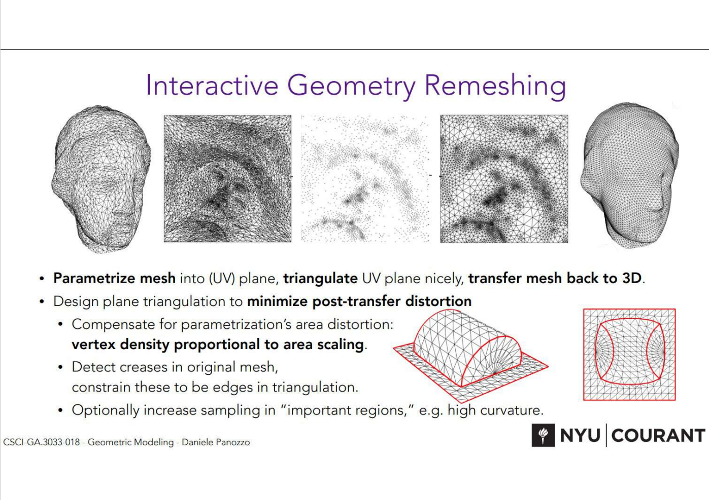

# Geometric_remeshing_project

A Python implementation of Pierre Alliez, Mark Meyer, and Mathieu Desbrun's research paper "Interactive Geometry Remeshing" : DOI=http://dx.doi.org/10.1145/566654.566588.

## problem statement

Below are the major steps involved in this pipeline:

1.	Mesh parametrization using Harmonic Parameterization
1.	Features extraction
1.	Control map design
1.	Control map sampling and preview
1.	Mesh creation through Delaunay triangulation (with optimization option)
1.  Reproject 2D mesh into 3D
